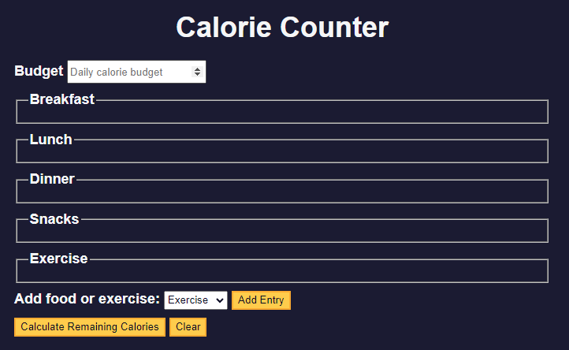

# Learn Form Validation by Building a Calorie Counter


## `.includes()`
Checking if the current character is not in the vowels array. If it is not, that current character is pushed into the `consonantArray`:
```
const inputString = "Hello World";
const charArray = inputString.split('');
const consonantArray = [];

for (let i = 0; i < charArray.length; i++) {
  if (!['a', 'e', 'i', 'o', 'u'].includes(charArray[i])) {
    consonantArray.push(charArray[i]);
  }
}
```

## `.replace()`
```
function cleanInputString(str) {
  const regex = /[+-\s]/g;
  return str.replace(regex, '');
}
```

## `.match()`
will return an array of match results – containing either the first match, or all matches if the global flag is used.
```
const str = 'example string';
const regex = /example/;
const result = str.match(regex); // Returns ['example']
```

## step 38
Now you need to target the `.input-container` element within the element that has your `targetId`. Declare a new `targetInputContainer` variable, and assign it the value of `document.querySelector()`. Use concatenation to separate `targetId` and ` .input-container` with a space, and pass that string to `querySelector()`.
```
function addEntry() {
  const targetId = '#' + entryDropdown.value;
  const targetInputContainer = document.querySelector(targetId + " .input-container");
}
```

## template literals
Allow you to interpolate variables directly within a string. Template literals are denoted with backticks ``, as opposed to single or double quotes. Variables can be passed in to a template literal by surrounding the variable with ${} – the value of the variable will be inserted into the string.
```
const name = "Naomi";
const templateLiteral = `Hello, my name is ${name}~!`;
```

## `querySelectorAll()`
Returns a `NodeList` of all the elements that match the selector.

## `innerHTML`
The `innerHTML` property sets or returns the `HTML` content inside an element.

Here is a `form` element with a `label` and `input` element nested inside.
```
<form id="form">
  <label for="first-name">First name</label>
  <input id="first-name" type="text">
</form>
```
If you want to add another `label` and `input` element inside the `form`, then you can use the `innerHTML` property as shown below:
```
const formElement = document.getElementById("form");
const formContent = `
  <label for="last-name">Last name</label>
  <input id="last-name" type="text">
`;
formElement.innerHTML += formContent;
```

## insertAdjacentHTML()
Preserve the previous input content. The `insertAdjacentHtml` method takes two arguments. The first argument is a string that specifies the position of the inserted element. The second argument is a string containing the HTML to be inserted.

## addEventListener 
Add a click event to a button. When the button is clicked, the `printName` function is called.
```
<button class="btn">Print name</button>

const button = document.querySelector('.btn');
function printName() {
  console.log("Jessica");
}
button.addEventListener('click', printName);
```
The `addEventListener` method takes two arguments. The first is the event to listen to. (Ex. `'click'`) The second is the callback function, or the function that runs when the event is triggered.

## `Number`
The `Number` constructor is a function that converts a value to a number. If the value cannot be converted, it returns `NaN` which stands for "Not a Number".
```
Number('10'); // returns the number 10
Number('abc'); // returns NaN
```

## preventDefault()
Prevent default action