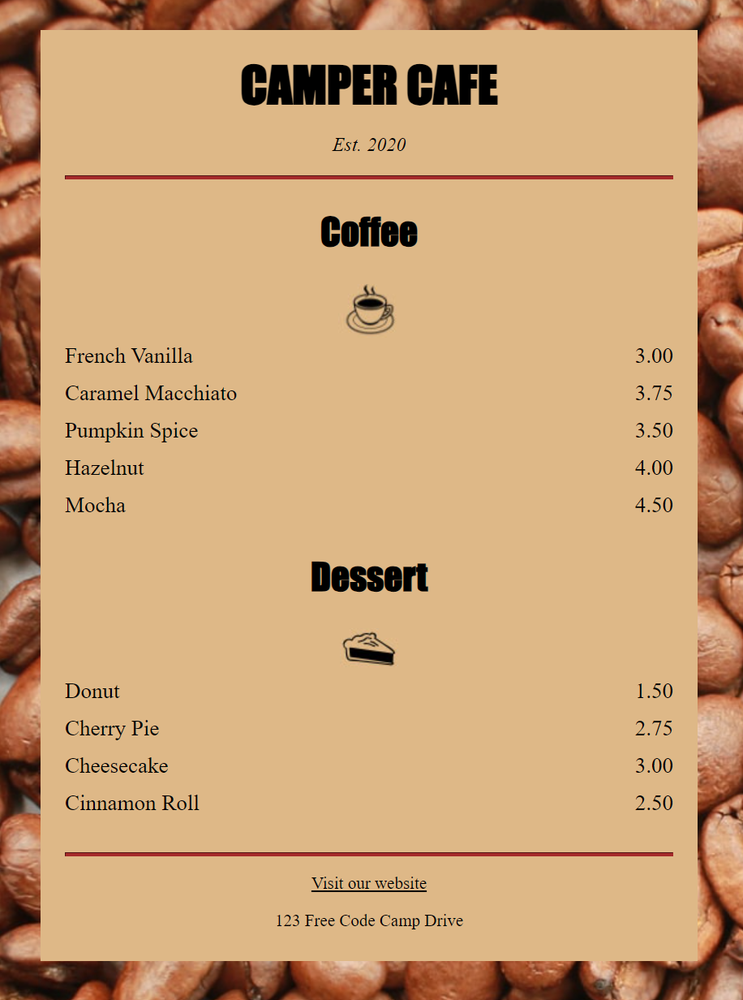

# Cafe Menu App


## `<article>`
独立的、完整的、可以独立分配或重用的内容块

## `<div>`
通用的块级容器，没有特定的语义

# CSS
## `margin: auto;` 
通常用于水平居中固定宽度的块级元素, 元素宽度是相对于父元素的百分比或是自适应的，`margin: auto;` 将不会使其水平居中。
垂直居中通常需要使用其他技术，例如 `Flexbox` 或 `Grid` 布局。要实现水平和垂直居中，通常需要结合使用这些布局技术。例如：
### Flexbox 居中:
```
.container {
  display: flex;
  justify-content: center; /* 水平居中 */
  align-items: center; /* 垂直居中 */
}
```

### Grid 居中:
```
.container {
  display: grid;
  place-items: center; /* 居中 */
}
```

### 绝对定位（仅限宽度未知的情况）:
```
.container {
  position: relative;
}

.centered-element {
  position: absolute;
  left: 50%;
  top: 50%;
  transform: translate(-50%, -50%);
}
```
这些方法中，Flexbox 和 Grid 是现代布局技术，推荐使用它们来实现居中效果。 Flexbox 特别适用于单一轴线的布局，而 Grid 布局适用于复杂的网格布局。

## `display`:
块级元素的 `display` 属性决定了元素的显示类型。块级元素在默认情况下会以块的形式显示，它们会独占一行，并且在前后都会产生换行。