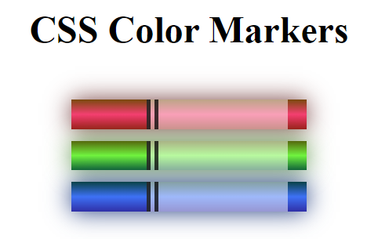

# Getting Started with Create React App


## `linear-gradient()`
CSS 中用于创建线性渐变的函数。它可以在两个或多个颜色之间创建平滑的渐变效果。
```
linear-gradient(45deg, red, yellow);
```

## `box-shadow`
是 CSS 中用于在元素周围创建阴影效果的属性。它允许你添加一个或多个阴影效果，通过指定阴影的偏移、模糊半径、扩展半径和颜色等属性来定义阴影的外观。

## `RGB（Red, Green, Blue）`
```
rgb(255, 0, 0); /* 红色 */
rgb(0, 255, 0); /* 绿色 */
rgb(0, 0, 255); /* 蓝色 */
```

## `RGBA（Red, Green, Blue, Alpha）`
`rgba` 同样表示颜色，但包含了一个额外的透明度通道`Alpha`，用于表示颜色的透明度，取值范围为 0（完全透明）到 1（完全不透明）
```
rgba(255, 0, 0, 0.5); /* 半透明的红色 */
rgba(0, 255, 0, 0.8); /* 80% 不透明的绿色 */
rgba(0, 0, 255, 0); /* 完全透明的蓝色 */
```

## `background-color` VS `background-color`
### 功能范围：
`background-color`专门用于设置背景颜色，而`background`则是一个综合属性，可以用于设置元素的完整背景，包括颜色、图像、定位等。

### 语法复杂度： 
`background-color`的语法简单，只需要指定颜色值即可；而`background`的语法较为复杂，需要设置多个子属性.