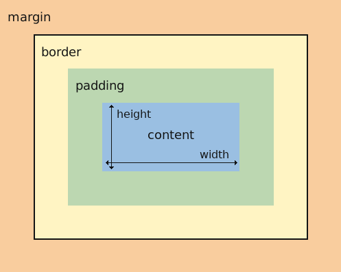
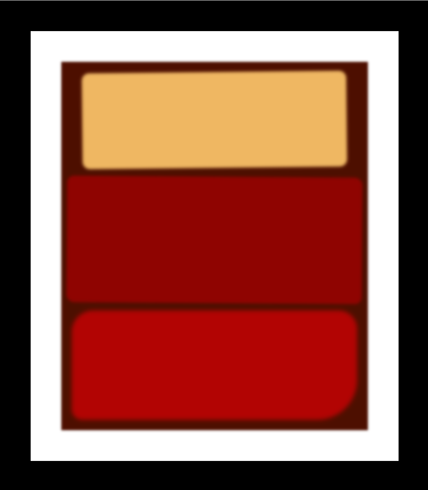

# Getting Started with Create React App



## `box`
The content is surrounded by a space called padding, similar to how bubble wrap separates an item from the box around it.

Margin is the area outside of the box, and can be used to control the space between other boxes or elements.

## `filter: blur(2px)`
用于在网页中对元素应用模糊效果, 可以用来创建一些视觉上的柔和效果

## `border-radius: 8px 10px`
用于设置元素的边框半径，使其呈现圆角，四个角都可以设置，`border-radius: top-left, top-right, bottom-right, bottom-left`

## `transform`
对元素进行变换。它可以实现多种变换效果，如旋转、缩放、平移、倾斜等。
- 平移 (translate)：
```
translateX(value)：沿 X 轴平移元素。
translateY(value)：沿 Y 轴平移元素。
translate(x, y)：同时沿 X 和 Y 轴平移元素。
```
- 旋转 (rotate)：
```
rotate(angle)：围绕元素中心点旋转。
```
- 缩放 (scale)：
```
scaleX(value)：沿 X 轴缩放元素。
scaleY(value)：沿 Y 轴缩放元素。
scale(x, y)：同时沿 X 和 Y 轴缩放元素。
```
- 倾斜 (skew)：
```
skewX(angle)：围绕 X 轴倾斜元素。
skewY(angle)：围绕 Y 轴倾斜元素。
skew(x, y)：同时围绕 X 和 Y 轴倾斜元素。
```
- 组合变换：
```
matrix(a, b, c, d, e, f)：通过一个 2x3 矩阵定义一个变换，其中 a 到 f 是矩阵的六个值。
```
使用 transform 属性时，你可以组合多个变换函数，按照需要对元素进行复杂的变换。例如：
```
transform: rotate(45deg) translate(50px, 50px) scale(1.5);
```
上述例子将元素首先以45度角旋转，然后沿 X 和 Y 轴平移50像素，最后沿 X 和 Y 轴分别缩放1.5倍。

