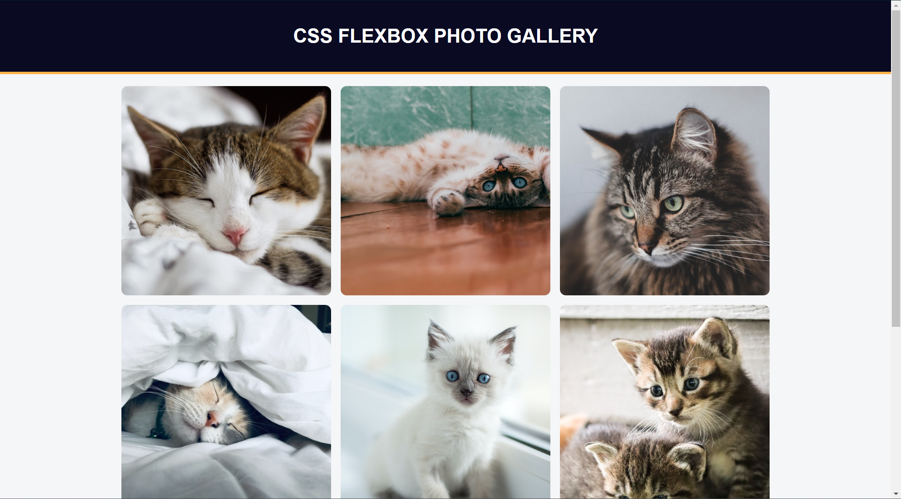

# Getting Started with Create React App


## `box-sizing`
用于设置盒子模型的计算方式。在CSS中，有两种主要的盒子模型：`content-box` 和 `border-box`。
- `content-box`（默认值）：元素的宽度和高度只包括内容的宽度和高度，不包括边框和内边距。如果给元素设置了宽度和高度，那么元素的整体大小将会包括内容区域、内边距和边框。

- `border-box`：元素的宽度和高度包括内容、内边距和边框的宽度。换句话说，给元素设置的宽度和高度表示的是整个框的大小，而内容区域会根据边框和内边距的大小而收缩。

`box-sizing` 属性可以应用于所有元素，用于改变它们的盒子模型。例如：
```
* {
  box-sizing: border-box;
}
```
这样设置后，页面中的所有元素都会采用 `border-box` 模型，使得设置元素大小更为直观和方便。

## `display: flex`
CSS中用于创建弹性布局的属性。当你将这个属性应用于一个元素时，该元素就成为一个弹性容器（flex container），其子元素成为弹性项目（flex items）。

弹性布局允许你创建一个灵活的、自适应的布局，其中子元素的大小可以根据容器的大小动态调整。以下是一些 `display: flex;` 的特点和用法：

- 主轴和交叉轴：
弹性容器具有主轴（main axis）和交叉轴（cross axis）。默认情况下，主轴是水平的，从左到右，交叉轴是垂直的，从上到下。你可以通过设置 flex-direction 来改变主轴的方向。

- 弹性项目的排列：
弹性项目默认沿主轴排列。你可以通过 justify-content 属性来控制弹性项目在主轴上的对齐方式，如居中、居左、居右等。

- 弹性项目的伸缩：
弹性项目可以根据需要伸缩。通过 flex 属性，你可以指定一个弹性项目相对于其他项目的伸缩比例，决定它们在可用空间中占据的比例。

- 自动换行：
默认情况下，弹性项目会在一行上排列。如果空间不足，它们会缩小。你可以通过设置 flex-wrap 来启用弹性项目在需要时换行。

- 弹性容器和弹性项目的属性：
除了 `flex-direction`、`justify-content`、`flex` 和 `flex-wrap` 之外，还有其他一些属性，如 `align-items`、`align-self``、order` 等，可以更精细地控制弹性容器和弹性项目的布局。
示例：
```
.container {
  display: flex;
  justify-content: space-between;
  align-items: center;
}

.item {
  flex: 1;
}
```
这个示例创建了一个弹性容器，其中的弹性项目会在主轴上分散排列，且在交叉轴上居中对齐。每个弹性项目都会等比例地占据可用空间。

## `flex-direction` 
用于设置弹性容器主轴方向的CSS属性。它决定了弹性项目在弹性容器内是如何排列的。这个属性有以下几个可能的取值：
- `row`: 将弹性项目水平排列。主轴从左到右。
- `row-reverse`: 与 row 相反，弹性项目水平排列，但主轴从右到左。
- `column`: 将弹性项目垂直排列。主轴从上到下。
- `column-reverse`: 与 column 相反，弹性项目垂直排列，但主轴从下到上。

## `flex-wrap`
用于设置弹性容器中弹性项目换行行为的 CSS 属性。默认情况下(`nowrap`)，弹性项目都会在一行上排列，如果空间不足，它们会被压缩。通过设置 `flex-wrap`，你可以控制在弹性容器中是否允许弹性项目换行。
- `nowrap`(default);弹性项目不换行，它们会在一行上尽量排列。
- `wrap`: 弹性项目允许在需要时换行，形成多行。
- `wrap-reverse`: 与 `wrap` 相反，弹性项目允许在需要时换行，但是换行方向相反。

## `justify-content` 
用于设置弹性容器中弹性项目在主轴上的对齐方式的 CSS 属性。
- flex-start（默认值）: 弹性项目在主轴上起点对齐。
- flex-end: 弹性项目在主轴上终点对齐。
- center: 弹性项目在主轴上居中对齐。
- space-between: 弹性项目在主轴上平均分布，首尾项目贴边。
- space-around: 弹性项目在主轴上平均分布，项目两侧都有空间。
- space-evenly: 弹性项目在主轴上平均分布，包括首尾两侧和每个项目之间的空间。

## `object-fit`
用于控制替换元素（比如 ``、`<video>` 或 `<object>`）内容在其容器中的布局方式的 CSS 属性
- `fill`: 默认值。替换元素的内容被拉伸以充满整个容器，可能导致内容的宽高比发生变化。
- `contain`: 内容被缩放以适应容器，保持其宽高比。可能会在容器内留有空白。
- `cover`: 内容被缩放以充满容器，保持其宽高比。可能会被裁剪以适应容器。
- `none`: 内容将保持其原始大小，不会缩放。如果内容大于容器，可能会被裁剪。
- `scale-down`: 内容将按比例缩放，以适应容器，但不会超过原始大小。

## `::after`
是 CSS 伪元素中的一种，它用于在某个元素的内容的最后创建一个虚拟的子元素。伪元素是一种通过 CSS 选择器而不是实际的 HTML 元素来选择和样式化文档中的某些部分的方法。
```
p::after {
  content: '"';
}
```
在这个例子中，`::after` 伪元素被用于在每个 `<p>` 元素的内容的末尾插入一个双引号。注意，`content` 属性用于定义伪元素的内容。

你可以通过设置不同的样式属性，如 `content`、`display`、`position`、`background` 等，来自定义 `::after` 伪元素的外观和行为。这种方式允许你在不改变 HTML 结构的情况下，通过 CSS 进行更灵活的样式控制。